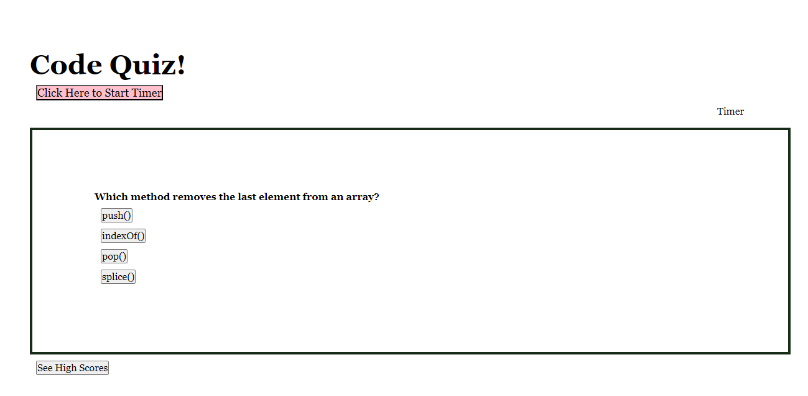

# theCodeQuiz

## Description

This is a good beginning to what could be a dynamic coding quiz.

Are you new to coding? Want to test your knowledge? This quiz makes answering coding questions fun by utilizing buttons and color correction.

## Installation

No installation or sign-up required! Simply follow this link: [click here](https://kathrynfisher3700.github.io/theCodeQuiz/)

## Usage

A goal is to start the quiz when you click "Click Here to Start Timer".
For now, your timer starts when you load the page and the first question is loaded. 

When you answer the question, the button you chose will flash 🟩GREEN for correct or 🟥RED for incorrect. 

The timer begins at 75seconds. With each correct answer, 10sec is removed; with each incorrect answer, 10sec is added. The goal is to recieve the lowest time possible.

## Credits

Idea and logic path provided by UCF Coding Bootcamp.

Special thanks to my classmates in the UCF Coding Bootcamp.

Comment line art found at [Ascii art](https://www.asciiart.eu/ascii-one-line)

Javascript how-to found at [W3 Schools](https://www.w3schools.com/jsref/event_onclick.asp)

## Improvements To Be Made
-Start button initilizes timer and shows first question 🚨

-Display timer countdown ⏱️

-Prompt and store: initials and score 📌

-High Score button revealing previous initials and scores in order from highest to 
lowest 📈

